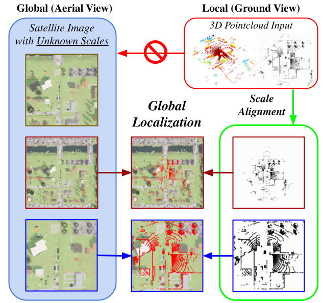
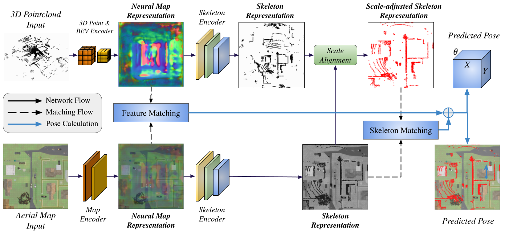

# [AGL-NET: Aerial-Ground Cross-Modal Global Localization with Varying Scales] [link](https://arxiv.org/abs/2404.03187) (Accepted by IROS 2024)
[](https://github.com/rayguan97/AGL-Net/stargazers)
[](https://github.com/rayguan97/AGL-Net/network)
[](https://github.com/rayguan97/AGL-Net/issues)
[](https://github.com/rayguan97/GANav-offroad/blob/master/LICENSE)


This is the code base and [dataset release](https://drive.google.com/file/d/1ek6jcYRsHIhw6b3gUxVzwzU4LvyMwSUo/view?usp=sharing) for:
[AGL-NET: Aerial-Ground Cross-Modal Global Localization with Varying Scales](https://arxiv.org/abs/2404.03187)
<br> [Tianrui Guan*](https://tianruiguan.phd), [Ruiqi Xian∗](https://ricky-xian.github.io/), Xijun Wang, Xiyang Wu, Mohamed Elnoor, Daeun Song, Dinesh Manocha

# The repo is still being updated. Please stay tuned for the training and experiments on KITTI dataset.


 


If you find this project useful in your research, please cite our work:

```latex
@misc{guan2024aglnetaerialgroundcrossmodalglobal,
title={AGL-NET: Aerial-Ground Cross-Modal Global Localization with Varying Scales}, 
author={Tianrui Guan and Ruiqi Xian and Xijun Wang and Xiyang Wu and Mohamed Elnoor and Daeun Song and Dinesh Manocha},
year={2024},
eprint={2404.03187},
archivePrefix={arXiv},
primaryClass={cs.CV},
url={https://arxiv.org/abs/2404.03187}, 
booktitle={2024 IEEE/RSJ International Conference on Intelligent Robots and Systems (IROS)}, 
}
```

# Env setup

### Step 1: Create Conda Environment

```
conda create -n aglnet python=3.10 -y
conda activate aglnet

pip install torch==2.0.0 torchvision==0.15.1 torchaudio==2.0.1 --index-url https://download.pytorch.org/whl/cu118

pip install numpy opencv-python Pillow tqdm matplotlib plotly scipy omegaconf hydra-core pytorch-lightning torchmetrics jupyter lxml rtree httpx aiolimiter scikit-learn urllib3 open3d tensorboard fpsample einops scikit-image

pip install -U openmim
mim install mmengine
mim install 'mmcv>=2.0.0rc4, <2.2.0'
mim install 'mmdet>=3.0.0, <3.3.0'
mim install "mmdet3d>=1.1.0"
```


# Dataset preparation

All of the data is under <root>/datasets/<dataset_name>. See instructions for each dataset below.

## Carla

You can use [the data we already collected](https://github.com/rayguan97/AGL-Net?tab=readme-ov-file#download-our-data), or you may run [transfuser repo](https://github.com/autonomousvision/transfuser) and follow [our instructions](https://github.com/rayguan97/AGL-Net?tab=readme-ov-file#collect-your-own-data) to slightly modify the code to collect your own data.

### Download our data

#### Step 1: Download the data

Download the data we collected from carla using [this link](https://drive.google.com/file/d/1ek6jcYRsHIhw6b3gUxVzwzU4LvyMwSUo/view?usp=sharing), unzip and put the content within the carla folder from the zip file under the `datasets/carla` folder.

### Collect your own data

#### Step 1: Setup [transfuser repo](https://github.com/autonomousvision/transfuser)
Follow their [setup instruction](https://github.com/autonomousvision/transfuser?tab=readme-ov-file#setup).

#### Step 2: Modify code

You can modify their code by replacing the corresponding files in [transfuser repo](https://github.com/autonomousvision/transfuser) with the files in the [transfuser_mod folder](https://github.com/rayguan97/AGL-Net/tree/main/transfuser_mod).

1. leaderboard/leaderboard/autoagents/agent_wrapper_local.py
    * change MAX_ALLOWED_RADIUS_SENSOR to a very large number (e.g.50000000000).
2. leaderboard/leaderboard/leaderboard_evaluator_local.py
3. team_code_autopilot/data_agent.py
    * added saving *topdown_rgb* view.

#### Step 3: Run script

```
./CarlaUE4.sh --world-port=2000 -opengl
./leaderboard/scripts/datagen.sh <carla root> <working directory of this repo (*/transfuser/)>
```

[Example script](https://github.com/rayguan97/AGL-Net/blob/main/transfuser_mod/leaderboard/scripts/gen_scripts/datagen_01-7-weather.sh)

#### Step 4: Processing steps
```
python -m maploc.data.carla.create_split_json
python -m maploc.data.carla.prepare
```

#### Step 5: Cleaning up (Optional)
If you feel that the collected dataset is too large, after running step 4, you can run the [cleaning script](https://github.com/rayguan97/AGL-Net/blob/main/maploc/data/carla/clean_up.py) to clean up the images and points that are not used.

```
cd maploc/data/carla/
<set data_dir based on your carla dir>
python clean_up.py
```


## KITTI (Rq -- you can refer to orienter_net and add our own additional processing step)


# Training & Evaluation

## Carla
```
python -m maploc.train_carla_aglnet_small experiment.name=aglnet_small experiment.gpus=4 data.loading.train.batch_size=48 data.loading.train.num_workers=12 data.loading.val.batch_size=24 data.loading.val.num_workers=2

python -m maploc.train_carla_aglnet experiment.name=aglnet experiment.gpus=4 data.loading.train.batch_size=4 data.loading.train.num_workers=4 data.loading.val.batch_size=4 data.loading.val.num_workers=4
```

To evaluate, download the checkpoint (download [here](https://drive.google.com/drive/folders/1Dn4A2GZ15na5XR_sokl8fcn6kwxuHXbP?usp=sharing)) and run the following:
```
python -m maploc.evaluation.carla --experiment checkpoint_aglnet_small.ckpt --data_cfg carla_small.yaml

python -m maploc.evaluation.carla --experiment checkpoint_aglnet.ckpt --data_cfg carla.yaml
```

## KITTI (Rq)


# Acknowledgement

The source code of AGL-Net is based on [OrienterNet
](https://github.com/facebookresearch/OrienterNet). Our data collection is also based on [transfuser](https://github.com/autonomousvision/transfuser). 